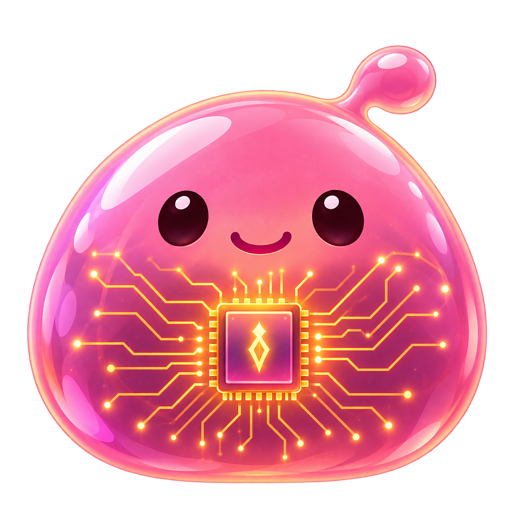
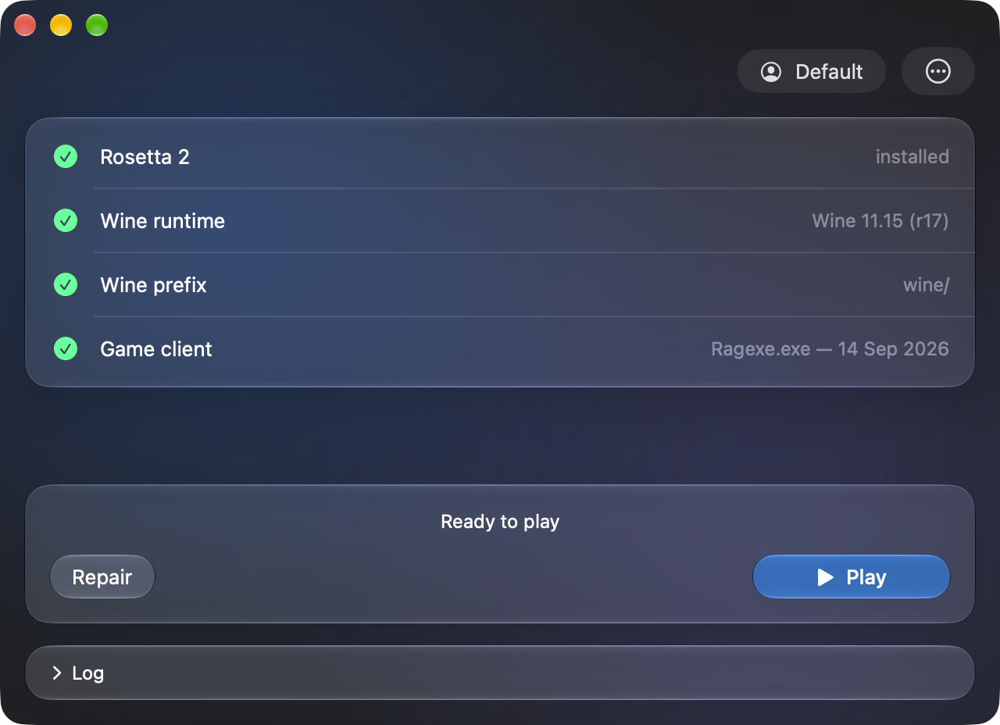

<p align="center">
  
</p>

# ROSilicon

**Play Ragnarok Online LATAM on your Apple Silicon Mac.** One window that
installs the game and runs it — no Windows, no Boot Camp, no Wine to set up
yourself, nothing to configure.

<p align="center">
  
</p>

[**Download the latest version →**](https://github.com/victormlourenco/ROSilicon/releases/latest)

Everything the game needs is already inside the app: its own build of Wine, the
Direct3D translation, and the speed-ups that make the client playable under
Rosetta. The only thing downloaded when you install is the game client itself.

## What you need

- A Mac with **Apple Silicon** (M1 or newer). Intel Macs are not supported.
- **macOS 14 Sonoma** or newer.
- **Rosetta 2.** The launcher checks for it first and tells you in a second if
  it is missing; install it with `softwareupdate --install-rosetta` in Terminal.
- About **12 GB of free disk space**, and a connection to download the ~4.8 GB
  client.

## Get started

> The same steps with pictures, in **[English](https://github.com/victormlourenco/ROSilicon/wiki/Getting-Started)**,
> **[Português](https://github.com/victormlourenco/ROSilicon/wiki/Primeiros-Passos)** and
> **[Español](https://github.com/victormlourenco/ROSilicon/wiki/Primeros-Pasos)**, are on the wiki.

1. **Download** `ROSilicon-<version>.dmg` from the
   [releases page](https://github.com/victormlourenco/ROSilicon/releases/latest).
2. **Open the disk image** and drag **ROSilicon** onto the **Applications**
   folder beside it.
3. **Open the app.** macOS will refuse the first time — the app is not signed
   with a paid Apple developer certificate, so your Mac has no way to check who
   made it. Open **System Settings › Privacy & Security**, scroll to the notice
   about ROSilicon and click **Open Anyway**, then open the app again. (On older
   macOS versions, right-clicking the app and choosing **Open** is enough.)
4. **Click Install.** It creates the Windows environment and downloads the game
   client, showing each step as it goes. It takes a while, mostly the download;
   an interrupted one picks up where it left off the next time. **Log** shows
   what is happening in detail.
5. **Click Play.** The game starts. That is it — from now on, opening ROSilicon
   and pressing Play is the whole routine.

Press **Play** again while the game is running to open a second client in the
same account folder — handy for a vending character. **Quit Game** closes all of
them at once.

## Settings worth knowing

They are in the **`…` menu** in the top right, and each one is remembered.

| | |
|---|---|
| **Use ⌘ for Game Shortcuts** | On by default. Sends ⌘A/C/V/X/Z to the game as Alt shortcuts, the way the client expects, instead of Mac editing commands. Use Control for copy and paste in chat. Takes effect the next time the game starts. |
| **Use F1–F12 as Function Keys in Game** | Off by default. Turn it on and the top row sends F1–F12 for your hotkey bars while the game is open, instead of brightness and volume — and goes back to normal the moment you close the client. Hold `fn` for brightness and volume in the meantime. |
| **Show Game Activity in Discord** | On by default. Your friends see **Playing Ragnarok Online** and for how long, if the Discord app is open on this Mac. |
| **Profile** menu (beside `…`) | A profile is a separate installation of the game — its own client, its own settings, its own logins. Use one per account if you like; the default profile is the one you already have. |
| **Reinstall Game Client…** | Downloads and unpacks the client again when something in the game folder is broken. Your profiles and settings stay. |
| **Clear Installation Folder…** | Moves everything the launcher installed to the Trash, after asking. |

Holding **⌥ Option** while the menu is open reveals the rest: the installation
folder, the client's download URL, a Metal frame-rate overlay, the choice of
[x87 translation](docs/x87-translation.md), `WINEDEBUG` and extra environment
variables, `winecfg` and `cmd.exe`, and **Copy Log**.

## Where the game lives

Everything the launcher installs goes in one folder:

```
~/Library/Application Support/ROSilicon
```

The app itself never writes anywhere else, so **updating is just replacing
ROSilicon in Applications** — your game and settings are untouched. To remove
everything, use **Clear Installation Folder…** and then drag the app to the
Trash.

## If something goes wrong

- **macOS says the app cannot be opened, or is damaged.** That is the missing
  signature, not a broken download — see step 3 above. If **Open Anyway** is not
  offered, run `xattr -dr com.apple.quarantine /Applications/ROSilicon.app`.
- **Install stops right away, asking for Rosetta.** Run
  `softwareupdate --install-rosetta` in Terminal and try again.
- **The download stalls or fails.** Press **Install** again; it resumes and
  verifies what it already has.
- **The function keys still change the brightness.** Turn on **Use F1–F12 as
  Function Keys in Game** — and note it only applies while a client is open.
- **The game crashes or will not start.** Hold ⌥ in the `…` menu, switch **x87
  Translation** to **None (Stock Rosetta)** and try again: it is slower, but it
  tells a bug in the speed-up apart from a bug in the game. Then **Copy Log** and
  [open an issue](https://github.com/victormlourenco/ROSilicon/issues) with it.

## Languages

The launcher speaks **English**, **Português (Brasil)** and **Español**, and
follows whichever language your Mac is set to.

## Documentation

The technical documentation — how the app is built, what it bundles and why —
lives in **[docs/](docs/)**:

- [Building ROSilicon](docs/building.md) and the [repository layout](docs/layout.md)
- [How the app installs and runs the game](docs/how-it-works.md), and [profiles](docs/profiles.md)
- [Keyboard](docs/keyboard.md), [Discord Rich Presence](docs/discord.md), [x87 translation](docs/x87-translation.md)
- [The Wine runtime](docs/wine-runtime.md), [DXVK](docs/dxvk.md), [the Steam stub](docs/steam-stub.md)
- [Languages](docs/languages.md)

## Credits

- **WineAndAqua** — [WineAndAqua/wine](https://github.com/WineAndAqua/wine) — the
  macOS Wine the bundled runtime is built from, at the commit
  `Packaging/WineRuntime/runtime-lock.json` pins.
- **WoWSilicon** — [WoWSilicon/WoWSilicon](https://github.com/WoWSilicon/WoWSilicon)
  — the Wine patches and runtime tooling this one's is built with, the library
  overlays it carries, and the Rosetta work behind it.
- **x87sidecar** — [athei/x87sidecar](https://github.com/athei/x87sidecar) — the
  x87 hook the runtime re-execs into; the bundled binary is that project's
  release, tracked in `Packaging/X87Sidecar/x87sidecar-lock.json`. Built on
  [Lifeisawful/rosettax87_jit](https://github.com/Lifeisawful/rosettax87_jit).
- **rosettax87_jit** — [Lifeisawful/rosettax87_jit](https://github.com/Lifeisawful/rosettax87_jit)
  — the alternative x87 hook behind ⌥; the bundled binaries are WoWSilicon's,
  tracked in `Packaging/RosettaX87JIT/rosettax87_jit-lock.json`.
- **Fluor** — [Pyroh/Fluor](https://github.com/Pyroh/Fluor) — how the function
  key mode is read and written, from its `FKeyManager` (MIT), which in turn
  derives from `fntoggle`. No code is bundled; only the approach is borrowed.
- **Wintrust patch** — [alexandrephz/ragnarok-no-linux](https://gitlab.com/alexandrephz/ragnarok-no-linux)
- **DXVK / D9VK** — [K0bin/dxvk](https://github.com/K0bin/dxvk), branch
  `moltenvk-version`, which `make d9vk` builds from the commit
  `Packaging/D9VK/source-lock.json` pins, with our patches on top.
  [Sikarugir-App/d9vk](https://github.com/Sikarugir-App/d9vk) is the fork of it
  the checked-in `Resources/d9vk/d3d9.dll` came from. Both descend from
  [doitsujin/dxvk](https://github.com/doitsujin/dxvk).

## License

ROSilicon is free software, licensed under the
[GNU General Public License v3.0](LICENSE) or, at your option, any later
version. It comes with no warranty. The components it bundles — the Wine
runtime, `x87sidecar`, `rosettax87_jit`, DXVK/D9VK — keep the licenses of their own projects,
listed under [Credits](#credits).

ROSilicon is not affiliated with Gravity or Gnjoy LATAM. It installs the
publisher's own client and does not change it.
